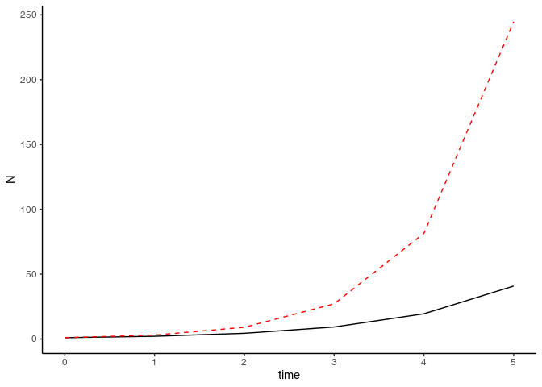
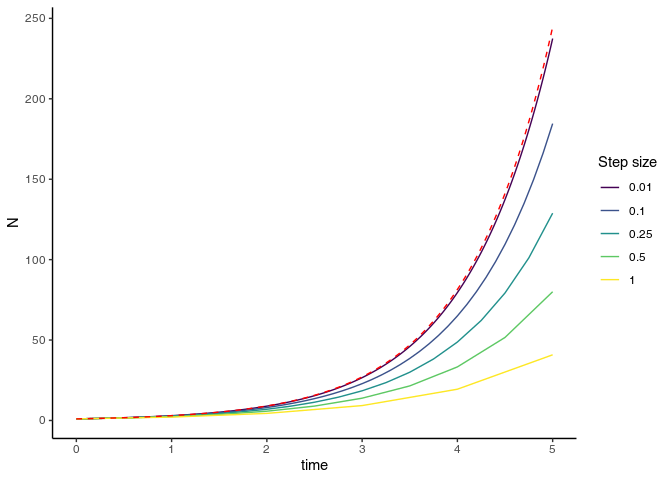
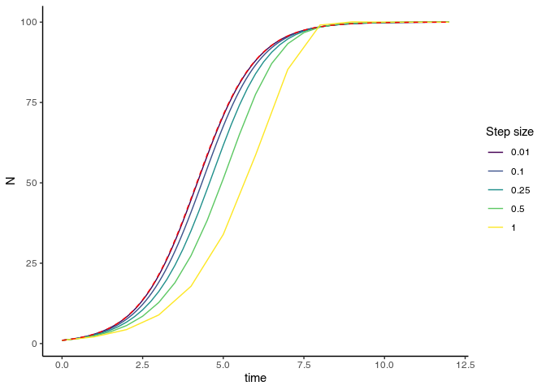
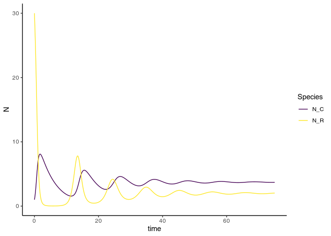

Numerical ODE Methods
================
Christopher R. Peterson

``` r
# Some basic utility packages
library(ggplot2)
library(dplyr)
library(purrr)
library(tidyr)
theme_set(theme_classic())
```

# Initial value problems

Say we have a differential equation (e.g., exponential growth) and its
initial value at time *t* = 0 (*N*<sub>0</sub>):

$$\\frac{d N} {d t} = r N; \\phantom{0} N\_0=2$$
We want to know what value *N* will be at some arbitrary time
*t* &gt; 0. In this case, we can use an analytic solution
(*N* = *N*<sub>0</sub>*e*<sup>*r**t*</sup>); however, this is not an
option for most ODEs.

## Euler’s method

<!-- This will be on the blackboard -->

The simplest way to numerically integrate an ODE is with Euler’s method.
For many ODEs, we can approximate the change in *N* over a short time
time *h* as
$$N\_{t + h} - N\_t \\approx h {\\frac{dN}{dt}} \\bigg\|\_{N = N\_t}$$

Euler’s method breaks time into chunks of *h* and repeatedly applies
this relationship to estimate *N* over time.

First, let’s define R functions for our ODE:

``` r
#' @param N population size
#' @param r instantaneous growth rate
#' @param ... ignored 
exponential_ode = function(N, r = 1.1, ...) { 
  N * r
}
#' @param t time
#' @param N_0 initial population size
#' @param r instantaneous growth rate
exponential_analytic = function(t, N_0 = 2, r = 1.1) {
  N_0 * exp(r * t)
}
```

Now, we can implement a simple version of Euler’s Method:

``` r
#' A single Euler method step:
#' @param N_t N at the previous time
#' @param step_size h, the amount of time between steps
#' @param ode_func the ode function; must N as an argument
#' @param ... additional arguments for ode_func()
euler_step = function(N_t, step_size, ode_func, ...) {
  delta_N = step_size * ode_func(N = N_t, ...) # change in N
  N_t + delta_N # Return N_{t + h}
}
#' Runs the complete Euler Method for an ODE with one variable
#' @param N_0 initial value
#' @param max_time maximum time
euler_method = function(N_0, ode_func = exponential_ode, step_size = 1, max_time = 5, ...) {
  # Create a vector of all time points
  time_seq = seq(from = 0, to = max_time, by = step_size)
  n_steps = length(time_seq)
  # Create empty output vector
  output = numeric(n_steps)
  output[1] = N_0 # initialize first step
  # Use a loop to apply euler_step() to each time point
  for(i in 2:n_steps) { # Skip the first one, as that's t = 0
    output[i] = euler_step(N_t = output[i - 1], step_size = step_size,
                           ode_func = ode_func, ...)
  }
  # Return N and time
  data.frame(time = time_seq, N = output)
}
```

Now, let’s see what it does

``` r
euler_exp_test = euler_method(
  N_0 = 1,  ode_func = exponential_ode,
   r = 1.1, # r is captured by ... and passed to ode_func
   step_size = 1)
```

Let’s compare this with the analytical results:

``` r
#' Helper function to visualize Euler Method results
#' @param data euler_method output
#' @param analytic_func function for analytical solution; first argument should be time
#' @param ... additional arguments to analytic_func()
plot_euler = function(data, analytic_func = exponential_analytic, ...) {
  data %>% 
  mutate(N_real = analytic_func(time, ...) )%>% 
  ggplot(aes(x = time)) + 
  geom_line(aes(y = N)) + 
  geom_line(aes(y = N_real), color = "red", linetype = 2)
}
plot_euler(euler_exp_test, N_0 = 1, r = 1.1) # Euler method in black, analytical in red & dashed
```

<!-- -->

Not ideal. What happens when we reduce the step size?:

``` r
step_sizes = c(1, 0.5, 0.25, 0.1, 0.01)

#' This runs euler_method several times with different step sizes;
#' @param step_sizes a vector of step sizes to compare
#' @param ... all other parameters for euler_method()
iterate_euler_step_size = function(step_sizes, ...) {
  # If you're unfamiliar with the purrr package, 
  # This is basically a for() loop that runs euler_method() at each step size
  # and returns a combined data frame
  map_dfr(step_sizes, function(size) {
    euler_method(..., step_size = size) %>% mutate(step_size = size)
    })
  }

euler_exp_step_comparison = iterate_euler_step_size(
  step_sizes,  r = 1.1, N_0 = 1, ode_func = exponential_ode)

euler_exp_step_comparison %>% 
  plot_euler(N_0 = 1, r = 1.1) +
  aes(color = as.factor(step_size)) + 
  scale_color_viridis_d("Step size")
```

<!-- -->

The `euler_method()` function is multi-purpose, in that it can find the
solution for a variety of 1 variable ODE functions. Let’s try the same
thing for a logistic growth model:

``` r
logistic_ode = function(N, r = 1.1, K = 100) {
  N * r * (1 - N/K)
}
logistic_analytic = function(t, N_0, r = 1.1, K = 100) {
  K / (1 + ((K - N_0)/N_0) * exp(-r * t)  )
}
```

``` r
euler_logis_step_comparison = iterate_euler_step_size(
  step_sizes,  ode_func = logistic_ode, 
  r = 1.1, N_0 = 1, K = 100,
  max_time = 12)


euler_logis_step_comparison %>%
  plot_euler(logistic_analytic, r = 1.1, N_0 = 1, K = 100) +
  aes(color = as.factor(step_size)) + 
  scale_color_viridis_d("Step size")
```

<!-- -->

Euler methods can be decent approximations at low step size; however,
this can require a very large number of iterations to solve. For more
complex models, this can become an unacceptable computation burden.

## The deSolve package

The `deSolve` package has a large number of ODE integrators that are
generally more sophisticated than Euler’s method.

``` r
library(deSolve)
# helper function to print deSolve objects
print_ode = function(x) knitr::kable(head(as.data.frame(x)))
```

To use deSolve, we need to make a few adjustments to how we need to
define our ODE functions with the following arguments:

-   `t`: Time. In many cases, this is ignored by the ODE, but some
    models require it
-   `y`: a named numeric vector of the state variables
-   `parms`: a named list of parameters
-   `...` additional arguments

The return values should be a list, of which the first element is the
derivatives of `y`.

For exponential growth model, this would look like:

``` r
#' Exponential Growth ODE function designed for deSolve
#' @param t ignored
#' @param y population size (should be named N_R)
#' @param parms a list with an element named r
#' @param ... ignored
exponential_ode_dslv = function(t, y, parms, ...) {
  d_y = y * parms$r
  list(d_y) # return value
}
```

Now, let’s run the ode with deSolve.

``` r
time_seq = seq(0, 10, by = .1)
exponential_desolve = ode(y = c(N = 1), # Initial Values
                          times = time_seq, # Times to return values from
                          parms = list(r = 1.1), # List of parameters
                          func = exponential_ode_dslv) # ODE Function
print_ode(exponential_desolve)
```

| time |        N |
|-----:|---------:|
|  0.0 | 1.000000 |
|  0.1 | 1.116278 |
|  0.2 | 1.246077 |
|  0.3 | 1.390970 |
|  0.4 | 1.552709 |
|  0.5 | 1.733255 |

By default, `deSolve` uses an automatic method selection process that
works pretty well for most models. If you need to change it, you
probably know more about this material than I do.

**Exercise:** Convert the logistic growth model to work with deSolve.

## ODE Systems

Numerical methods can also be used on systems of differential equations.
Let’s look at a two-species Consumer-Resource model:

The ode function would follow the same pattern

``` r
#' Consumer Resource model
#' @param t ignored
#' @param y population sizes of resource and consumer (should be named N_R and N_C)
#' @param parms a list with an element named r, K, a, b, and d
#' @param ... ignored
cr_ode = function(t, y, parms, ...) {
  vars_and_parms = c(parms, as.list(y)) # conbine y and parms into a single list
  with(vars_and_parms, {# WOrk within the rest of vars and parms
    # within with(), we can use the names of everything in parms and y w/o using $
    dN_R = N_R * (r * (1 - N_R/K) - a * N_C)
    dN_C = N_C * (a * b * N_R - d)
    derivs = c(dN_R, dN_C) 
    list(derivs) # return derivatives, wrapped in a list
  })
}
```

``` r
# Setup the parameters and initial values
cr_parms = list(r = 2, K = 30, a = .5, b = .2, d = .2)
cr_init = c(N_R = cr_parms$K, N_C = 1) # Begin with N_R at carrying capacity, N_C with a single invader

# Run it
cr_times = seq(0, 75, by = .05)
cr_deSolve = ode(y = cr_init, times = cr_times,
             func = cr_ode, parms = cr_parms)
# View the output:
print_ode(cr_deSolve)
```

| time |     N\_R |     N\_C |
|-----:|---------:|---------:|
| 0.00 | 30.00000 | 1.000000 |
| 0.05 | 29.24293 | 1.148106 |
| 0.10 | 28.46629 | 1.313106 |
| 0.15 | 27.66282 | 1.495902 |
| 0.20 | 26.82648 | 1.697179 |
| 0.25 | 25.95259 | 1.917326 |

``` r
# Plot the results
cr_deSolve %>% 
  as.data.frame() %>% 
  pivot_longer(-time, names_to = "Species", values_to = "N") %>% 
  ggplot(aes(x = time, y = N, group = Species, color = Species)) + 
  geom_line() + 
  scale_color_viridis_d()
```

<!-- -->

Try experimenting with different parameter values or starting
conditions.

# Equilbria & Stability

We can also use numerical methods to approximate the equilibrium values
of linear systems of ODEs. For linear systems, you can use matrix
algebra; with non-linear systems, you can use the `rootSolve` package.

## Identifying equilbrium points

The `stode` function uses optimization to find steady points. For
nonlinear systems, you’ll need to chose an initial starting value when
trying to locate equilibria. For many systems, there are multiple
solutions; trying different initial values can help identify different
steady points.

``` r
library(rootSolve)

# Steady points with several different sets of starting values:

cr_steady1 = stode(y = cr_init, time = 0, func = cr_ode, parms = cr_parms)
cr_steady1
## $y
##           N_R           N_C 
##  3.000000e+01 -1.446112e-18 
## 
## attr(,"precis")
## [1] 8.900000e+00 1.083491e-07 3.343539e-15
## attr(,"steady")
## [1] TRUE
cr_steady2 = stode(y = c(N_R = 10, N_C = 10), time = 0,  func = cr_ode, parms = cr_parms)
cr_steady2
## $y
##      N_R      N_C 
## 2.000000 3.733333 
## 
## attr(,"precis")
## [1] 2.233333e+01 4.335224e+00 6.885158e-01 9.485261e-02 3.256373e-03
## [6] 4.444911e-06 8.326806e-12
## attr(,"steady")
## [1] TRUE
cr_steady3 = stode(y = c(N_R = 0, N_C = 1), time = 0,  func = cr_ode, parms = cr_parms)
cr_steady3
## $y
##           N_R           N_C 
##  0.000000e+00 -5.263558e-10 
## 
## attr(,"precis")
## [1] 1.000000e-01 5.263558e-11
## attr(,"steady")
## [1] TRUE
cr_steady4 = stode(y = c(N_R = 1, N_C = 10), time = 0,  func = cr_ode, parms = cr_parms)
cr_steady4
## $y
##      N_R      N_C 
## 2.000000 3.733334 
## 
## attr(,"precis")
## [1] 2.033333e+00 5.417204e-01 1.994646e+00 3.841226e-01 3.774240e-02
## [6] 5.643028e-04 1.340478e-07
## attr(,"steady")
## [1] TRUE
```

Alternatively, the `runsteady()` identifies stable points by simulating
the ODE until it reaches a region of minimal change.

``` r
runsteady(y = cr_init, 
          time = c(0, 500), # time is c(initial_time, max_time)
          func = cr_ode, parms = cr_parms)
```

    ## $y
    ##      N_R      N_C 
    ## 2.000000 3.733333 
    ## 
    ## attr(,"istate")
    ##  [1]      2      1      1      0      0      5 100000      0      0      0
    ## [11]      0    751    979     52      1      1      0     44     22      0
    ## [21]      0      2      2
    ## attr(,"rstate")
    ## [1]  22.89253  22.89253 425.03593   0.00000   0.00000
    ## attr(,"precis")
    ## [1] 2.463883e-09
    ## attr(,"steady")
    ## [1] TRUE
    ## attr(,"time")
    ## [1] 425.0359
    ## attr(,"steps")
    ## [1] 751

For some systems (particularly those with cycles), `runsteady` won’t
find a single equilibrium point; however, it can be used to find a
reasonable inital value for `stode`.

## Jacobians

Once we have equilibrium points, we can examine the jacibian at that
position. Here’s the Jacobian for the Consumer-Resource model:

$$J = \\left( \\begin{array}{cc}
-a N\_C + r(1 - \\frac{2 N\_R}{K}) & -a N\_R\\\\
 a b N\_C & a b N\_R - d\\\\
\\end{array}\\right)$$

First, let’s turn the jacobian into a function:

``` r
cr_jacobian = function(y, parms) {
  vars_and_parms = c(parms, as.list(y)) # conbine y and parms into a single list
  with(vars_and_parms, {
    matrix(c(
      r - a * N_C - 2 * r * N_R/K,   -a * N_R,
      a * b * N_C,                   -d + a * b * N_R),
    nrow = 2, ncol = 2, byrow = TRUE)
  })
}
```

To check stability, evaluate the Jacobian at the equilbrium part and
look at the eigenvalues:

``` r
cr_steady1$y
```

    ##           N_R           N_C 
    ##  3.000000e+01 -1.446112e-18

``` r
eigen(cr_jacobian(cr_steady1$y, cr_parms))
```

    ## eigen() decomposition
    ## $values
    ## [1]  2.8 -2.0
    ## 
    ## $vectors
    ##            [,1] [,2]
    ## [1,] -0.9524241    1
    ## [2,]  0.3047757    0

If all of the eigenvalues are negative, the steady state is stable

``` r
cr_steady2$y
```

    ##      N_R      N_C 
    ## 2.000000 3.733333

``` r
eigen(cr_jacobian(cr_steady2$y, cr_parms))
```

    ## eigen() decomposition
    ## $values
    ## [1] -0.0666667+0.6073622i -0.0666667-0.6073622i
    ## 
    ## $vectors
    ##                       [,1]                  [,2]
    ## [1,] -0.8533202+0.0000000i -0.8533202+0.0000000i
    ## [2,]  0.0568880+0.5182745i  0.0568880-0.5182745i

Note that for this one, the eigenvalues are complex, which indicates
that there is cyclic behavior.
